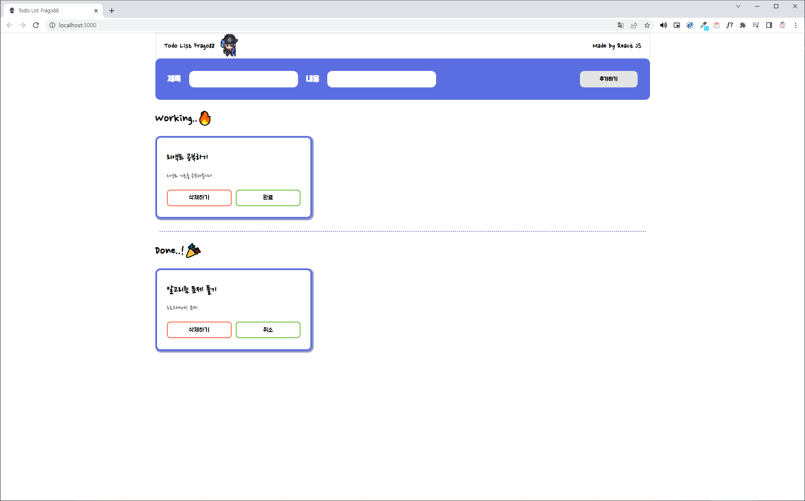

# TODO LIST



---

### 사용 기술

<div align=center>
<a href="https://developer.mozilla.org/ko/docs/Web/HTML">
  
</a>
<a href="https://developer.mozilla.org/ko/docs/Web/CSS">
  
</a>
<a href="https://developer.mozilla.org/ko/docs/Learn/JavaScript">
  
</a>
<a href="https://ko.reactjs.org/docs/getting-started.html">
  
</a>
<br>
</div>

---

### 디렉토리 구조
```bash
├── node_modules
├── public
│   ├── ex.png
│   ├── favicon.ico
│   ├── index.html
│   ├── logo.png
│   ├── manifest.json
│   └── robots.txt
│
├── src
│   ├── components
│   │   ├── form
│   │   │     ├── Form.jsx
│   │   │     └── style.css
│   │   ├── header
│   │   │     ├── Header.jsx
│   │   │     └── style.css
│   │   ├── layout
│   │   │     ├── Layout.jsx
│   │   │     └── style.css
│   │   ├── list
│   │   │     ├── List.jsx
│   │   │     └── style.css
│   │   └── todo
│   │         ├── Todo.jsx
│   │         └── style.css
│   ├── pages
│   │     └── TodoList.jsx
│   │
│   ├── App.css
│   ├── App.js
│   ├── App.test.js
│   ├── index.css
│   ├── index.js
│   ├── logo.svg
│   ├── reportWebVitals.js
│   └── setupTests.js
│ 
├── .gitignore
├── package.json
├── README.md
└── yarn.lock
``` 

---

### 프로젝트 1주차
220722-220728

---

#### 프로젝트 설명
- 나만의 ToDo 리스트를 만들고 관리합니다.
- ToDo 리스트를 추가 하고 삭제할 수 있습니다.
- 달성한 Todo는 버튼을 눌러 완료 상태로 만들 수 있습니다.

---

#### 요구 사항 분석
1. 제목과 내용을 입력하고, `추가하기` 버튼을 클릭하면 Working에 새로운 Todo가 추가되고 제목 input과 내용 input은 다시 빈 값으로 바뀌도록 구성.

2. Todo의 **isDone 상태가 true이면, 상태 버튼의 라벨을 `취소`, isDone이 false 이면 라벨을 `완료`** 로 조건부 렌더링 한다. 

3. Todo의 상태가 `Working` 이면 위쪽에 위치하고, `Done`이면 아래쪽에 위치하도록 구현.
        
4. Layout의 최대 넓이는 **1200px**, 최소 넓이는 **800px**로 제한하고, 전체 화면의 가운데로 정렬.


---

### 프로젝트 2주차
220728-220804

---

1주차의 Todo List 를 `react-router-dom`, `styled-components`, `redux` 를 사용해서 My Todo List 를 다시 제작한다.

---

- **공통**
    - **todos 데이터는 리덕스를 사용해서 전역으로 상태를 관리합니다.**
    - todos 모듈은 `**Ducks 패턴**`으로 구현합니다.
    - **컴포넌트 구조는 자유롭게 구현**하되, 본인이 그렇게 나눈 이유에 대해서 `README`에 작성합니다.
    
- **메인 페이지**
    - **디자인과 화면 구성은 자유롭게 구현합니다.**
    - **Todo의 상태에 “완료” 그룹과 “진행중" 그룹을 나뉘어서 보이도록 구현**합니다.  
    - **Todo를 추가하면  제목 `input`과 내용 `input`은 다시 빈 값이 되도록 구현**합니다.       
    - **input에 값이 있는 상태에서 상세페이지로 이동하는 경우, input의 value가 초기화** 되도록 구현합니다.
    - Todo의 완료상태**가 `true`**이면**,** 상태 버튼의 라벨을 **“취소”,  `false`** 이면 라벨을 “**완료”** 로 보이도록 구현합니다.
    - 전체 화면의 **최대 넓이는 `1200px`, 최소 넓이는 `800px`로 제한**하고, **컨텐츠를 화면의 가운데로 배치** 합니다.
    - `상세보기` 클릭하면 **Todo의 상세 페이지로 이동**합니다.
    
- **상세 페이지**
  상세 페이지의 디자인과 화면 구성은 자유롭게 구현하되, 아래 요소들은 보여야 합니다.
    - Todo의 ID
    - Todo의 제목
    - Todo의 내용
    - `이전으로` 버튼
        - `이전으로` 버튼을 구현하고, `이전으로` 버튼을 클릭하면 리스트 화면으로 되돌아 갑니다.
        
        
